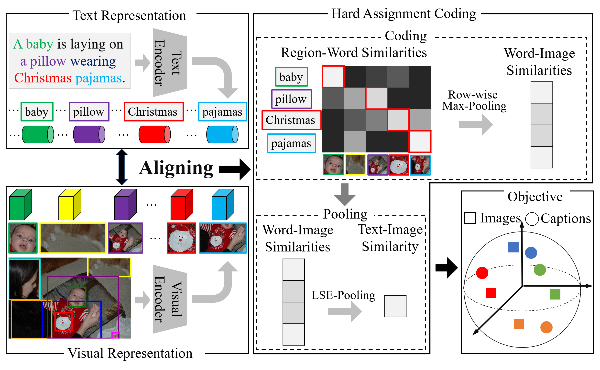

# Fine-grained Image-text Matching by Cross-modal Hard Aligning Network

## Introduction
This is the source code of CHAN accepted by CVPR2023. It is built on top of the [VSE$infty$](https://github.com/woodfrog/vse_infty) in PyTorch. 



## Requirements and Installation
We recommended the following dependencies.

* Python 3.7
* [PyTorch](http://pytorch.org/) 1.11.0
* [Transformers](https://github.com/huggingface/transformers) (4.18.0)
* The specific required environment can be found [here](requirements.txt)

## Results
#### Results on COCO 5K Test Split

| |Visual Backbone|Text Backbone|R1|R5|R1|R5|Link|
|---|:---:|:---:|---|---|---|---|---|
|CHAN | BUTD region |GRU-base|**60.2**|**85.9**|**41.7**|**71.5**|[Here]()|
|CHAN | BUTD region |BERT-base|**59.8**|**87.2**|**44.9**|**74.5**|[Here]()|

#### Results on Flickr30K Test Split

| |Visual Backbone|Text Backbone|R1|R5|R1|R5|Link|
|---|:---:|:---:|---|---|---|---|---|
|CHAN | BUTD region |GRU-base|**79.7**|**94.5**|**60.2**|**85.3**|[Here]()|
|CHAN | BUTD region |BERT-base|**80.6**|**96.1**|**63.9**|**87.5**|[Here]()|

## Data
We organize all data used in the experiments in the same manner as [VSEinf](https://github.com/woodfrog/vse_infty):

```
data
├── coco
│   ├── precomp  # pre-computed BUTD region features for COCO, provided by SCAN
│   │      ├── train_ids.txt
│   │      ├── train_caps.txt
│   │      ├── ......
│   │
│   ├── images   # raw coco images
│   │      ├── train2014
│   │      └── val2014
│   │
│   └── id_mapping.json  # mapping from coco-id to image's file name
│   
│
├── f30k
│   ├── precomp  # pre-computed BUTD region features for Flickr30K, provided by SCAN
│   │      ├── train_ids.txt
│   │      ├── train_caps.txt
│   │      ├── ......
│   │
│   ├── flickr30k-images   # raw coco images
│   │      ├── xxx.jpg
│   │      └── ...
|   |
│   └── id_mapping.json  # mapping from f30k index to image's file name
│   
│
└── vocab  # vocab files provided by SCAN (only used when the text backbone is BiGRU)
```

The download links for original COCO/F30K images, precomputed BUTD features, and corresponding vocabularies are from the offical repo of [SCAN](https://github.com/kuanghuei/SCAN#download-data). The ```precomp``` folders contain pre-computed BUTD region features, ```data/coco/images``` contains raw MS-COCO images, and ```data/f30k/flickr30k-images``` contains raw Flickr30K images. 

(Update: It seems that the download link for the pre-computed features in SCAN's repo is down, [this Dropbox link](https://www.dropbox.com/sh/qp3fw9hqegpm914/AAC3D3kqkh5i4cgZOfVmlWCDa?dl=0) provides a copy of these files. Please download and follow the above file structures to organize the data.)

The ```id_mapping.json``` files are the mapping from image index (ie, the COCO id for COCO images) to corresponding filenames, we generated these mappings to eliminate the need of the ```pycocotools``` package. 

Please download all necessary data files and organize them in the above manner, the path to the ```data``` directory will be the argument to the training script as shown below.

## Training

```bash
sh scripts/train.sh
```

## Evaluation

```bash
sh scripts/eval.sh
```

## Reference

If you found this code useful, please cite the following paper:
```
@inproceedings{pan2023chan,
    title={Fine-grained Image-text Matching by Cross-modal Hard Aligning Network},
    author={Pan, Zhengxin and Wu, Fangyu and Zhang, Bailing},
    booktitle={IEEE Conference on Computer Vision and Pattern Recognition (CVPR)},
    year={2023}
} 
```

